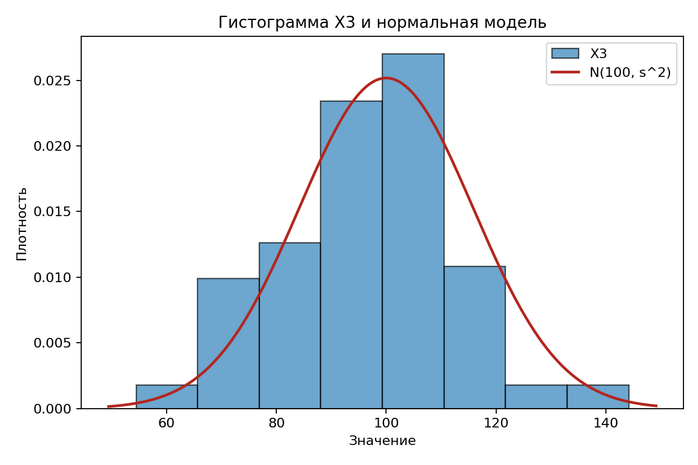
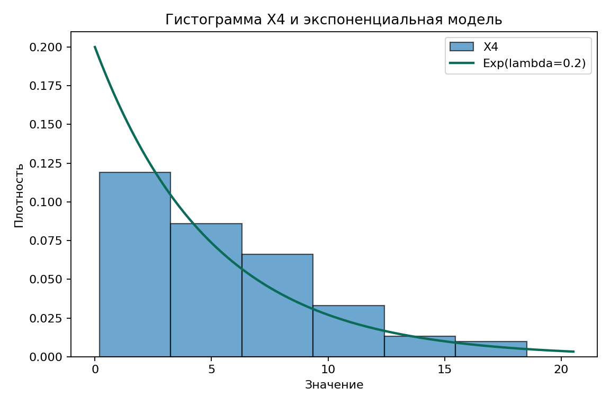

# Расчётно-графическая работа №2

## Вариант D-1

---

## Исходные данные


```math
n=99
```

| Характеристика | X1 | X2 | X3 | X4 |
|---|---:|---:|---:|---:|
| Выборочное среднее | 108.57485 | 113.78616 | 96.54737 | 5.36232 |
| Несмещённая дисперсия | 137.10690 | 186.45547 | 251.26524 | 17.70195 |
| Несмещённое стандартное отклонение | 11.70927 | 13.65487 | 15.85135 | 4.20737 |
| Медиана | 107.82000 | 113.12000 | 97.73000 | 4.08000 |
| Минимум | 85.15000 | 83.10000 | 54.41000 | 0.19000 |
| Максимум | 137.08000 | 142.94000 | 144.18000 | 18.52000 |

---

## 4.1. Постановка гипотез

Во всех пунктах используется уровень значимости:

```math
\alpha=0.05.
```

### 4.2. Равенство математических ожиданий X<sub>1</sub> и X<sub>2</sub>

- H<sub>0</sub>: E[X1] = E[X2].
- H<sub>1</sub>: E[X1] != E[X2].
- Критерий: двухвыборочный t-критерий Стьюдента.
- Ошибка первого рода: признать средние различными, хотя они равны.

### 4.3. Параметр нормального распределения X<sub>3</sub>

- H<sub>0</sub>: mu3 = 100.0.
- H<sub>1</sub>: mu3 != 100.0.
- Критерий: одновыборочный t-критерий.
- Ошибка первого рода: отвергнуть верное значение математического ожидания.

### 4.4. Однородность распределений X<sub>1</sub> и X<sub>2</sub>

- H<sub>0</sub>: распределения X1 и X2 одинаковы.
- H<sub>1</sub>: распределения X1 и X2 различаются.
- Критерий: критерий Манна-Уитни.
- Ошибка первого рода: признать распределения различными, хотя они одинаковы.

### 4.5. Согласие X<sub>4</sub> с Exp(lambda=0.2)

- H<sub>0</sub>: X4 имеет распределение Exp(lambda=0.2).
- H<sub>1</sub>: X4 не имеет это распределение.
- Критерий: критерий согласия Пирсона.
- Ошибка первого рода: отвергнуть верную модель распределения.

---

## 4.2. Равенство математических ожиданий X<sub>1</sub> и X<sub>2</sub>

```math
H_0:E[X_1]=E[X_2],
\qquad
H_1:E[X_1]\ne E[X_2].
```

```math
\alpha=0.05.
```

Критерий и исходные значения:

```math
\bar X_1-\bar X_2=-5.21131.
```

```math
T=
\frac{\bar X_1-\bar X_2}
{S_p\sqrt{\frac1{n_1}+\frac1{n_2}}},
\qquad
S_p^2=
\frac{(n_1-1)S_1^2+(n_2-1)S_2^2}
{n_1+n_2-2}.
```

```math
T\sim t_{n_1+n_2-2}.
```

```math
n_1=n_2=99.
```

```math
\bar X_1=108.57485,\qquad \bar X_2=113.78616.
```

```math
S_1^2=137.10690,\qquad S_2^2=186.45547.
```

```math
S_p^2=161.78118.
```

Статистика и решение:

```math
T_{\text{набл}}=-2.88261.
```

```math
\nu=n_1+n_2-2=196.
```

```math
t_{196;0.975}=1.97214.
```

```math
W=(-\infty;-1.97214]\cup[1.97214;+\infty).
```

```math
p=0.00438.
```

```math
|T_{\text{набл}}|=2.88261>1.97214,\qquad p=0.00438<0.05.
```

Гипотеза H<sub>0</sub> отвергается; среднее X<sub>2</sub> статистически значимо выше среднего X<sub>1</sub>. Решение принято на основе двухвыборочного t-критерия Стьюдента.

---

## 4.3. Параметр нормального распределения X<sub>3</sub>



```math
H_0:\mu_3=100.0,
\qquad
H_1:\mu_3\ne 100.0.
```

```math
\alpha=0.05.
```

Критерий и исходные значения:

```math
T=\frac{\sqrt n(\bar X_3-\mu_0)}{S_3}.
```

```math
T\sim t_{n-1}.
```

```math
n=99,\qquad \bar X_3=96.54737,\qquad S_3=15.85135.
```

Статистика и решение:

```math
T_{\text{набл}}=
\frac{\sqrt{99}(96.54737-100.0)}{15.85135}
=-2.16721.
```

```math
\nu=n-1=98.
```

```math
t_{98;0.975}=1.98447.
```

```math
W=(-\infty;-1.98447]\cup[1.98447;+\infty).
```

```math
p=0.03264.
```

```math
|T_{\text{набл}}|=2.16721>1.98447,\qquad p=0.03264<0.05.
```

Гипотеза H<sub>0</sub> отвергается; математическое ожидание X<sub>3</sub> статистически значимо отличается от 100.0. Решение принято на основе одновыборочного t-критерия.

---

## 4.4. Непараметрический критерий для X<sub>1</sub> и X<sub>2</sub>

```math
H_0:F_{X_1}(x)=F_{X_2}(x),
\qquad
H_1:F_{X_1}(x)\ne F_{X_2}(x).
```

```math
\alpha=0.05.
```

Ранги и статистика:

```math
N=n_1+n_2=198.
```

```math
E[U]=\frac{n_1n_2}{2}
=\frac{99\cdot99}{2}
=4900.50000.
```

```math
D[U]=
\frac{n_1n_2}{12}
\left(
N+1-\frac{\sum_j(t_j^3-t_j)}{N(N-1)}
\right)
=162532.99873.
```

```math
Z_{\text{набл}}=-2.93808.
```

Решение:

```math
p=0.00330.
```

```math
p=0.00330<0.05.
```

Гипотеза H<sub>0</sub> отвергается; X<sub>1</sub> и X<sub>2</sub> статистически значимо различаются. Решение принято на основе критерия Манна-Уитни.

---

## 4.5. Критерий согласия для X<sub>4</sub>



```math
H_0:X_4\sim Exp(\lambda=0.2),
\qquad
H_1:X_4 \not\sim Exp(\lambda=0.2).
```

```math
\alpha=0.05.
```

Интервалы и частоты:

```math
q_p=-\frac{\ln(1-p)}{\lambda}.
```

```math
m=6,\qquad p_k=\frac16,\qquad np_k=\frac{99}6=16.5.
```

```math
np_k=16.5>5.
```

| Интервал | n_k | p_k | np_k | (n_k-np_k)^2/np_k |
|---|---:|---:|---:|---:|
| [0.000; 0.912) | 10 | 0.16667 | 16.500 | 2.56061 |
| [0.912; 2.027) | 12 | 0.16667 | 16.500 | 1.22727 |
| [2.027; 3.466) | 15 | 0.16667 | 16.500 | 0.13636 |
| [3.466; 5.493) | 22 | 0.16667 | 16.500 | 1.83333 |
| [5.493; 8.959) | 23 | 0.16667 | 16.500 | 2.56061 |
| [8.959; +∞) | 17 | 0.16667 | 16.500 | 0.01515 |
| Итого | 99 | 1.00000 | 99.000 | 8.33333 |

Статистика и решение:

```math
\chi^2_{\text{набл}}=\sum_{k=1}^6\frac{(n_k-np_k)^2}{np_k}=8.33333.
```

```math
\nu=m-1=5.
```

```math
\chi^2_{5;0.95}=11.07050.
```

```math
p=0.13880.
```

```math
\chi^2_{\text{набл}}=8.33333<11.07050,\qquad p=0.13880>0.05.
```

Нет оснований отвергнуть H<sub>0</sub>; выборка X<sub>4</sub> не противоречит экспоненциальному распределению с параметром lambda=0.2. Решение принято на основе критерия согласия Пирсона.

---

## 4.6. Итог

### 4.2. Равенство математических ожиданий X<sub>1</sub> и X<sub>2</sub>

- Критерий: двухвыборочный t-критерий Стьюдента.
- p-value: 0.00438.
- Решение: H<sub>0</sub> отвергается.
- Вывод: X<sub>2</sub> имеет статистически значимо более высокое среднее.

### 4.3. Параметр нормального распределения X<sub>3</sub>

- Критерий: одновыборочный t-критерий.
- p-value: 0.03264.
- Решение: H<sub>0</sub> отвергается.
- Вывод: математическое ожидание X<sub>3</sub> статистически значимо отличается от 100.0.

### 4.4. Однородность распределений X<sub>1</sub> и X<sub>2</sub>

- Критерий: критерий Манна-Уитни.
- p-value: 0.00330.
- Решение: H<sub>0</sub> отвергается.
- Вывод: распределения X<sub>1</sub> и X<sub>2</sub> статистически значимо различаются.

### 4.5. Согласие X<sub>4</sub> с Exp(lambda=0.2)

- Критерий: критерий согласия Пирсона.
- p-value: 0.13880.
- Решение: H<sub>0</sub> не отвергается.
- Вывод: X<sub>4</sub> согласуется с Exp(lambda=0.2).
